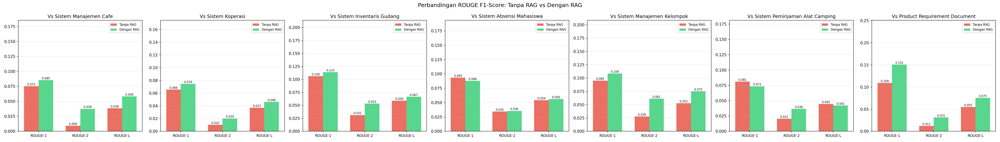

<p align="center">
  <!-- Animated terminal SVG -->
  <svg xmlns="http://www.w3.org/2000/svg" viewBox="0 0 760 220" width="760">
    <defs>
      <style>
        @keyframes blink { 0%,100%{opacity:1} 50%{opacity:0} }
        @keyframes scan  { 0%{transform:translateY(2px)} 100%{transform:translateY(196px)} }
        @keyframes pulse { 0%,100%{opacity:.4} 50%{opacity:1} }
        @keyframes type  { 0%{clip-path:inset(0 100% 0 0)} 100%{clip-path:inset(0 0 0 0)} }
        @keyframes glow  { 0%,100%{filter:drop-shadow(0 0 2px #d00)} 50%{filter:drop-shadow(0 0 8px #dc2626)} }
        .glow { animation:glow 2s ease-in-out infinite }
        .cursor { animation:blink .8s step-end infinite }
        .scanline { animation:scan 4s linear infinite }
        .type-text { animation:type 3s steps(40) forwards; white-space:nowrap; overflow:hidden }
      </style>
    </defs>
    <!-- Background terminal -->
    <rect x="0" y="0" width="760" height="220" rx="0" fill="#111" stroke="#dc2626" stroke-width="2"/>
    <!-- Title bar -->
    <rect x="2" y="2" width="756" height="32" fill="#1a1a1a"/>
    <line x1="2" y1="34" x2="758" y2="34" stroke="#333" stroke-width="1"/>
    <circle cx="22" cy="18" r="5" fill="#dc2626"/>
    <circle cx="40" cy="18" r="5" fill="#555"/>
    <circle cx="58" cy="18" r="5" fill="#555"/>
    <text x="380" y="23" font-family="monospace" font-size="11" fill="#666" text-anchor="middle" letter-spacing="2">loehoer.ai — prd generator</text>
    <!-- Main title -->
    <text x="30" y="75" font-family="monospace" font-size="30" font-weight="800" fill="#dc2626" class="glow">&gt;&gt;&gt; loehoer.ai &mdash; prd generator &lt;&lt;&lt;</text>
    <text x="30" y="105" font-family="monospace" font-size="13" fill="#888">─────────────────────────────────────────────────</text>
    <!-- Info lines -->
    <text x="30" y="135" font-family="monospace" font-size="14" fill="#e0e0e0">$ model: <tspan fill="#dc2626">groq cloud (llama-3.1-8b-instant)</tspan></text>
    <text x="30" y="160" font-family="monospace" font-size="14" fill="#e0e0e0">$ rag  : <tspan fill="#dc2626">chromadb + miniml-l6-v2 — 7 pdf</tspan></text>
    <text x="30" y="185" font-family="monospace" font-size="14" fill="#e0e0e0">$ eval : <tspan fill="#dc2626">rouge-1/2/l</tspan></text>
    <!-- Blinking cursor -->
    <rect x="234" y="173" width="9" height="16" fill="#dc2626" class="cursor" rx="0"/>
    <!-- Scanline overlay -->
    <rect x="2" y="2" width="756" height="2" fill="rgba(220,38,38,0.15)" class="scanline"/>
  </svg>
</p>

<p align="center">
  <code>
  [<span style="color:#dc2626">rag</span>] [<span style="color:#dc2626">llm</span>] [<span style="color:#dc2626">rouge</span>] [<span style="color:#dc2626">fastapi</span>] [<span style="color:#dc2626">react</span>]
  </code>
</p>

<p align="center">
  <sub>rizki dzulfikar al-qatiri (2406118) &amp; naupal nahban (2406119)</sub>
</p>

---

```
>>> ringkasan
```

Pipeline <span style="color:#dc2626">**rag-based prd generator**</span> — groq cloud (`llama-3.1-8b-instant`) + chromadb + rouge-1/2/l.

```
pendekatan
  ├── [a] tanpa rag    → direct prompt, pengetahuan internal llm
  └── [b] dengan rag   → retrieval dari chromadb + konteks 7 pdf — model utama
```

---

```
>>> struktur
```

```
uas-kecerdasanbuatan/
├── laporan_uas.md                # laporan uas (10 section)
├── <span style="color:#dc2626">app</span>/
│   ├── chatbot.py                # llm pipeline (groq cloud)
│   ├── config.py                 # konfigurasi path & model
│   ├── rag_builder.py            # build chromadb vectorstore
│   ├── evaluate_dataset.py       # evaluasi rouge 7 pdf
│   ├── patch_notebooks.py        # patch notebook + inject output
│   ├── backend/                  # fastapi
│   └── frontend/                 # react — loehoer.ai
├── uas_model/
│   ├── signature_model.ipynb     # <span style="color:#dc2626">dengan rag</span>
│   └── comparison_model.ipynb    # <span style="color:#dc2626">tanpa rag</span>
├── data/
│   ├── dataset/                  # 7 pdf referensi
│   └── jurnal/                   # 5 referensi jurnal
├── output/                       # prd hasil generate (tracked)
├── report/                       # gambar evaluasi + rouge_results.json
└── requirements-cloud.txt
```

---

```
>>> pipeline
```

```
            800 chars               chromadb                rouge-1
pdf ──────▶ chunking ──────▶ embedding ──────▶ generate ──────▶ score
            7 docs                miniml                groq llm     rouge-l
```

---

```
>>> quick start
```

```bash
# 1. install
$ pip install -r requirements-cloud.txt

# 2. api key
$ cp .env.example .env
$ # isi llm_api_key (https://console.groq.com/keys)

# 3. build vectorstore
$ python3 -m app.rag_builder

# 4. run notebook — model utama (rag)
$ jupyter notebook uas_model/signature_model.ipynb

# 5. run notebook — model pembanding (tanpa rag)
$ jupyter notebook uas_model/comparison_model.ipynb

# 6. evaluasi rouge   $ python3 app/evaluate_dataset.py

# 7. patch notebook   $ python3 app/patch_notebooks.py
```

---

```
>>> konfigurasi llm
```

| variable      | default                                         | deskripsi         |
|---------------|-------------------------------------------------|-------------------|
| `llm_backend` | `cloud`                                         | groq cloud        |
| `llm_api_base`| `https://api.groq.com/openai/v1`                | endpoint          |
| `llm_api_key` | `—`                                             | api key           |
| `llm_api_model`| `llama-3.1-8b-instant`                        | model id groq     |

`.env`:
```
llm_backend=cloud
llm_api_key=gsk_...
```

---

```
>>> hasil evaluasi
```

<p align="center">
  
</p>

---

```
>>> referensi
```

```
 1 │ lewis et al. (2020) — retrieval-augmented generation for knowledge-intensive nlp tasks
 2 │ lin (2004)         — rouge: a package for automatic evaluation of summaries
 3 │ grattafiori et al. (2024) — the llama 3 herd of models
 4 │ kumar et al. (2024) — rouge-ss: a new rouge variant
 5 │ liu et al. (2024)  — how reliable are automatic evaluation methods
 6 │ tanwir et al. (2026) — rag llm-based chatbot for stunting prevention
```
