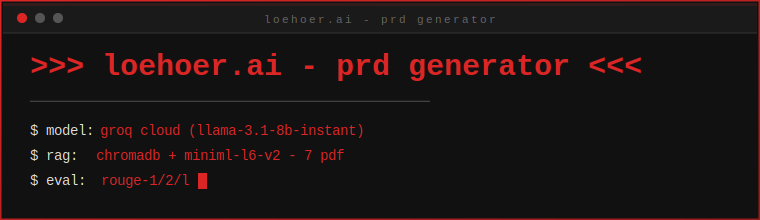

<p align="center">
  
</p>

<p align="center">
  <code>[<span style="color:#dc2626">rag</span>] [<span style="color:#dc2626">llm</span>] [<span style="color:#dc2626">rouge</span>] [<span style="color:#dc2626">fastapi</span>] [<span style="color:#dc2626">react</span>]</code>
</p>

<p align="center">
  <i>rizki dzulfikar al-qatiri (2406118) &amp; naupal nahban (2406119)</i>
</p>

---

## ringkasan

Pipeline <b style="color:#dc2626">rag-based prd generator</b> — groq cloud (llama-3.1-8b-instant) + chromadb + rouge-1/2/l.

**Dua pendekatan:**
- `[a]` tanpa rag — direct prompt, pengetahuan internal llm
- `[b]` dengan rag — retrieval dari chromadb + konteks 7 pdf — **model utama**

---

## struktur

<pre>
uas-kecerdasanbuatan/
├── Laporan_uas.md                # laporan uas (10 section)
├── <font color="#dc2626">App</font>/
│   ├── chatbot.py                # llm pipeline (groq cloud)
│   ├── config.py                 # konfigurasi path & model
│   ├── rag_builder.py            # build chromadb vectorstore
│   ├── evaluate_dataset.py       # evaluasi rouge 7 pdf
│   ├── patch_notebooks.py        # patch notebook + inject output
│   ├── backend/                  # fastapi
│   └── frontend/                 # react — loehoer.ai
├── UAS_Model/
│   ├── signature_model.ipynb     # <font color="#dc2626">dengan rag</font>
│   └── comparison_model.ipynb    # <font color="#dc2626">tanpa rag</font>
├── data/
│   ├── dataset/                  # 7 pdf referensi
│   └── Jurnal/                   # 5 referensi jurnal
├── output/                       # prd hasil generate + gambar evaluasi + json
└── requirements-cloud.txt
</pre>

---

## eda

<p align="center">
  
</p>

7 dokumen PDF referensi — chunking 800 karakter, embedding MiniLM-L6-v2, disimpan di ChromaDB.

---

## pipeline

<pre>
            800 chars               chromadb                rouge-1
pdf ─────────── chunking ─────────── embedding ─────────── generate ─────────── score
            7 docs                miniml                groq llm     rouge-l
</pre>

---

## quick start

```bash
# 1. install
$ pip install -r requirements-cloud.txt

# 2. api key (buat file .env)
$ cat > .env << EOF
llm_backend=cloud
llm_api_key=gsk_your_key_here
EOF
$ # isi llm_api_key (https://console.groq.com/keys)

# 3. build vectorstore
$ python3 App/rag_builder.py

# 4. run notebook - model utama (rag)
$ jupyter notebook UAS_Model/Signature_model.ipynb

# 5. run notebook - model pembanding (tanpa rag)
$ jupyter notebook UAS_Model/Comparison_model.ipynb

# 6. evaluasi rouge
$ python3 App/evaluate_dataset.py

# 7. patch notebook
$ python3 App/patch_notebooks.py

# 8. backend (fastapi)
$ cd App/backend && python3 main.py

# 9. frontend (react)
$ cd App/frontend && npm install && npm run dev
```

---

## konfigurasi llm

| variable      | default                                         | deskripsi         |
|---------------|-------------------------------------------------|-------------------|
| `llm_backend` | `cloud`                                         | groq cloud        |
| `llm_api_base`| `https://api.groq.com/openai/v1`                | endpoint          |
| `llm_api_key` | `—`                                             | api key           |
| `llm_api_model`| `llama-3.1-8b-instant`                        | model id groq     |

```env
llm_backend=cloud
llm_api_key=gsk_...
```

---

## hasil evaluasi

<p align="center">
  
</p>

---

## referensi

1. lewis et al. (2020) — retrieval-augmented generation for knowledge-intensive nlp tasks
2. lin (2004) — rouge: a package for automatic evaluation of summaries
3. grattafiori et al. (2024) — the llama 3 herd of models
4. kumar et al. (2024) — rouge-ss: a new rouge variant
5. liu et al. (2024) — how reliable are automatic evaluation methods
6. tanwir et al. (2026) — rag llm-based chatbot for stunting prevention
